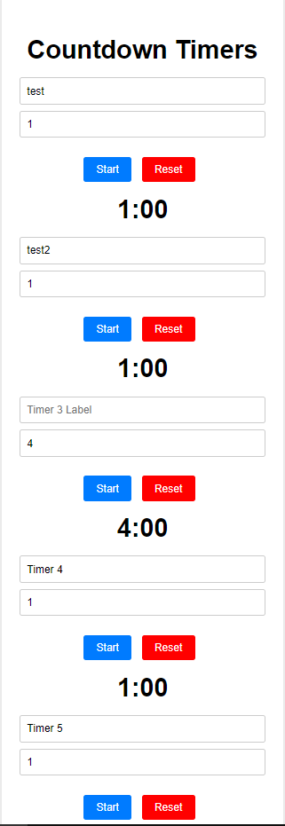

PHP and JavaScript app to display 5 timers, mobile friendly.
Each timer can have a user assigned label.
Each timer has a user settable countdown time.
All information is updated and saved in a json file, dynamically on the server with PHP.
Each page reload will bring up the users saved data.

